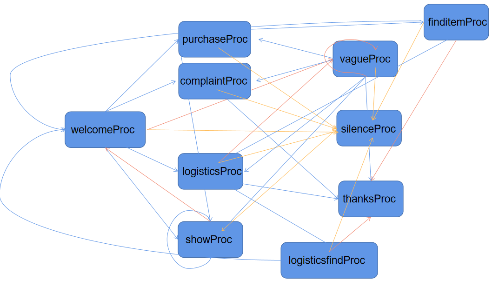
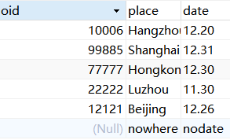

# **myRobot设计报告**

*班级：2019211309*

*学号：2019211567*

*姓名：范子豪*

[toc]

## **数据结构**
1. 脚本预测分析语法树
```c++
class stepbranch{
    public:
        stepbranch();                           //无参数构造函数
        stepbranch(string);                     //具有step名的构造函数
        string stepName;                        //step名
        vector<string> branchSet;               //branch集
        string defaultStep;                     //默认的下一步
        string silenceStep;                     //用户沉默的下一步
};
vector<stepbranch> branchPredictSet;            //脚本分支跳转树
```
2. 词法分析所需的结构
```c++
int *loc;                                            //当前扫描的指针位置
int line = 1;                                        //当前扫描的行数
int state = 0;                                       //当前的关键字状态
int curLength=0;                                     //记录当前识别的运算符长度
int number=0;                                        //各类符号总数
int num_of_sign[7]={0};                              //记录标识符，常数，运算符，界符，关键字，字符串数量
int character[512]={0};                              //区分各类符号
vector<int> buffer;                                  //脚本缓冲区
string token = "";                                   //词法分析中的当前识别token
string datasType[8]={"标识符","浮点数","运算符","界符","关键字","字符串","字符","整数"};     //各类符号
```
3. 脚本解释中的各类栈及hash表
```c++
vector<int> stateStack;                              //状态栈
vector<string> stepSet;                              //阶段名字集
unordered_map<string,int> entryDict;                 //各阶段的脚本入口hash表
unordered_map<string,int> keyDict;                   //关键字hash表
unordered_map<int,string> typeDict;                  //类型hash表
unordered_map<string,int> stateDict;                 //状态hash表
```
4. 用于脚本跳转预测的类
```c++
class statistic{                     //用于自然语言处理中通过各种匹配指标来判断下一个分支
    public:
        statistic();                 //构造函数
        int complaint;               //下一个分支为抱怨的指标
        int purchase;                //下一个分支为购买的指标
        int show;                    //下一个分支为展示的指标
        int logistics;               //下一个分支为物流的指标
        int thanks;                  //下一个分支为感谢的指标
        int welcome;                 //下一个分支为开场的指标
        int logfind;                 //下一个分支为物流查询的指标
        string findMax();            //通过以上指标寻找下一个分支
};
```
5. 各类符号/串集
```c++
set<string> op{                                     //操作符号集
    "!",      "!=",      "%",      "%=",      "&",
    "&&",     "&=",      "*",      "*=",      "+",
    "++",     "+=",      "-",      "--",      "-=",
    "->",     ".",       "/",      "/=",      ":",
    ":=",     "<",       "<<",     "<<=",     "<=",
    "=",      "==",      ">",      ">=",      ">>",
    ">>=",    "?",       "\\",     "^",       "^=",
    "|",      "|=",      "||",
};
set<string> delimiter{                              //界符集
"(",    ")",    "{",    "}",
"[",    "]",    ";",    ",",
"\"",   "\'",
};
set<string> type{                                    //关键字集
    "Speak",    "Step",    "Listen",    "Branch",
    "Exit",     "Default", "Show"  ,    "Find",
    "Silence"
};
set<string> complaint{                               //关于抱怨的可能字符串集
    "complain",  "compliant",   "hell",
    "trash",     "garbage",     "terrible",
    "bad",       "fucking",     "shit",
    "holy",      "wrong",       "pity",
    "poor",      "compliants",  "complains"
};
set <string> purchase{                               //关于购买的可能字符串集
    "buy",     "bought",    "purchase",
    "like",
};
set <string> show{                                   //关于展示的可能字符串集
    "show",          "look",      "introduce",
    "introduction",  "Show"
};
set <string> logistics{                              //关于物流的可能字符串集
    "where",   "Where",     "find",
    "express", "send",      "arrive",
    "when",    "When"
};
set <string> thanks{                                 //关于感谢的可能字符串集
    "thanks",   "thank",   "see you",   "bye",
    "ok",       "OK",      "Thank",     "fine",
    "Fine",     "well",    "Well",      "good",
    "Good"
};
set <string> welcome{                                //关于开场的可能字符串集
    "back",      "home page",    "start",
    "beginning", "welcome",      "return"
};
set <string> logfind{                                //关于查询物流的可能字符串集
    "0",   "1",   "2",   "3",
    "4",   "5",   "6",   "7",
    "8",   "9",   "SF",  "YT",
    "JD",  "ZT",  "sf",  "jd",
    "yt",  "zt"
};
set <string> item{                                   //关于商品的可能字符串集
    "pen",      "shoes",     "shoe",
    "clothes",  "watch",     "hat",
    "gloves",   "phone",     "computer",
    "book",     "glasses"
};
vector <QString> express{                            //关于快递商家的可能字符串集
    "SF",   "YT",   "JD",
    "ZT"
};
```
## **模块简介**
1. 模块划分
```
    模块1： 脚本读取
    模块2： 根据脚本构建脚本预测分支树等各类数据结构
    模块3： 校园网关登录
    模块4： 重定位脚本指针，开始脚本解释器词法分析
    模块5： 退出判断
```
2. 模块功能
```
    模块1：读取文件中的脚本内容，将其存在一个缓冲栈中。
    模块2：通过读取到的脚本内容，构建脚本分支预测树（重点），以及各阶段的入口位置hash表，各阶段名集等重要数据结构。
    模块3：通过调用QT自带api--QNetworkAccessManager向校园网url发包完成校园网登录，登陆成功即进入脚本解释器。
    模块4：将脚本指针重定位，启动脚本解释器的词法分析器，开始执行脚本。
    模块5：脚本分析到出口，用户控制是否退出程序。
```
3. 模块流程图
```flow
     st=>start: 脚本读取
    op1=>operation: 构建脚本预测分支树等
    op2=>operation: 校园网关登录
    op3=>operation: 重定位指针并开始分析
    cond=>condition: 退出?
    e=>end: 结束
    st->op1->op2->op3->cond
    cond(yes)->e
    cond(no)->op3
```
## **接口设计**
1. 类函数接口

|函数模型|函数功能|返回值类型|
|:---|:----|:----|
|stepbranch::stepbranch(string name)|构造函数，同时将该阶段的名字初始化|void|
|stepbranch::stepbranch()|构造函数，初始化类成员|void|
|statistic::statistic()|构造函数，初始化类成员|void|
|string statistic::findMax()|通过各个指标寻找下一个Step|string|
|loginwindow::onButtonPushClicked()|当点击登录按钮时，将用户名和密码打包发包给网关|void |
|loginwindow::netReply()|获取网关的回送包中的内容|void|
|MainWindow::sqlInitialization()|数据库初始化|void|
|MainWindow::on_pushButton_2_clicked()|点击退出界面|void|
|MainWindow::on_pushButton_3_clicked()|点击开始扫描|void|
|MainWindow::Listen(int seconds)|接收用户输入函数|void |
|MainWindow::outputProc(string data,int dataType)|对脚本关键字解析并指定下一个动作|void|
|MainWindow::scan()|扫描脚本|void|
|showform::process()|用messagebox阻塞父窗口的进程|void|
|showform::on_pushButton_clicked()|点击按钮退出窗口|void|
|Dialog::on_pushButton_clicked()|点击发送用户输入的信息|void|
|Dialog::on_pushButton_2_clicked()|点击退出脚本|void|
2. 外部函数接口

|函数模型|函数功能|返回值类型|
|:---|:----|:----|
|initMap()|初始化类型判别表|void|
|initDict()| 初始化各类哈希表，如入口表等|void|
|readBuffer()|读文件，将脚本读入缓冲区中|void|
|getChar()|获取缓冲区中下一个字符的输入，用于词法分析|int|
|natureLanguageProc(string ans)|对用户输入的自然语言进行对应的处理|void|
|isinSet(string str,vector<string> set)|判断一个字符串是否在一个字符集中|bool |
3. 用户接口

    **本次大作业我采用的是图形化用户接口，共设计了三个界面，如下图所示：**
    
    
    
    
    
    **一个对话框如下**

    

    用户通过该对话框进行输入交互
## **脚本记法**
1. 关键字：
```  
    "Speak",    "Step",    "Listen",    "Branch",
    "Exit",     "Default", "Show"  ,    "Find",
    "Silence"
```
|关键字|语法|作用|
|:----:|:----:|:----:|
|Speak|Speak "xxxx"|将后续内容展示到界面上,x为字符串|
|Step|Step xxxx|标志当前阶段名字，x为字符串|
|Listen|Listen xxxx|等待用户输入，等待时间为x（整型）|
|Branch|Branch xxxx|表示该阶段的后续的分支，x为字符串|
|Silence|Silence xxxx|表示该阶段的静默分支，x为字符串|
|Default|Default xxxx|表示该阶段的默认分支，x为字符串|
|Show|Show|展示店铺的商品内容|
|Find|Find|根据前一个用户输入的内容去寻找商品或者快递|
|Exit|Exit|退出该脚本解释器|
2. 标识符
```
    "welcomeProc",    "complaintProc",    "purchaseProc",    "logisticsProc",
    "showProc",       "finditemProc",    "silenceProc",     "logisticsfindProc",
    "vagueProc",      "thanksProc"
```
|标识符|功能|
|:---:|:---:|
|welcomeProc|脚本读取开始，欢迎用户|
|complaintProc|用户提出投诉需求|
|purchaseProc|用户提出购买需求|
|logisticsProc|用户提出查快递需求|
|showProc|用户提出展示店面需求|
|finditemProc|通过用户输入查找物品|
|silenceProc|用户静默|
|logisticsfindProc|通过用户输入查找快递|
|vagueProc|用户胡言乱语|
|thanksProc|用户提出感谢|
3. 界符
```
    界符只有一个'#',表示脚本结束
```
4. 脚本实例
```
    Step welcomeProc                            /*标志着进入welcome阶段*/
    Speak "Hello,what can I do for you!"        /*客服询问用户"Hello,what can I do for you!"*/
    Listen 10                                   /*聆听用户输入，10s未输入进入静默阶段*/
    Silence silenceProc                         /*静默阶段为silenceProc*/
    Branch complaintProc                        /*分支一为complaintProc*/
    Branch purchaseProc                         /*分支二为purchaseProc*/
    Branch logisticsProc                        /*分支三为logisticsProc*/
    Branch showProc                             /*分支三为showProc*/
    Default vagueProc                           /*默认分支为vagueProc*/
    /*通过用户的输入，进行自然语言分析，判断进入静默（超过默认时限未输入），投诉，购买，查物流，展示，以及默认阶段（胡言乱语）*/
```
## **测前分析**

1. 该脚本的语法树



```
"vagueProc"
default:---> "vagueProc"
silence:---> "silenceProc"
branchs:
---> "thanksProc"
---> "silenceProc"
---> "logisticsProc"
---> "complaintProc"
---> "purchaseProc"
---> "showProc"


"logisticsProc"
default:---> "vagueProc"
silence:---> "silenceProc"
branchs:
---> "thanksProc"
---> "silenceProc"
---> "logisticsfindProc"


"logisticsfindProc"
default:---> "thanksProc"
silence:---> "silenceProc"
branchs:
---> "silenceProc"
---> "welcomeProc"


"welcomeProc"
default:---> "vagueProc"
silence:---> "silenceProc"
branchs:
---> "silenceProc"
---> "logisticsProc"
---> "complaintProc"
---> "purchaseProc"
---> "showProc"


"complaintProc"
default:---> "thanksProc"
silence:---> "silenceProc"
branchs:
---> "silenceProc"


"purchaseProc"
default:---> "finditemProc"
silence:---> "silenceProc"
branchs:
---> "silenceProc"


"showProc"
default:---> "welcomeProc"
silence:---> "silenceProc"
branchs:
---> "silenceProc"
---> "purchaseProc"
---> "showProc"


"finditemProc"
default:---> "thanksProc"
silence:---> "silenceProc"
branchs:
---> "silenceProc"
---> "logisticsProc"
---> "welcomeProc"
```

2. 数据库预置




- - -
## **测试桩**

### 对自然语言识别并跳转的测试桩
#### 各step的测试步骤
```
Step welcomeProc
    Speak "Hello,what can I do for you!"
    Listen 10
    Silence silenceProc
    Branch complaintProc
    Branch purchaseProc
    Branch logisticsProc
    Branch showProc
    Default vagueProc
```
```
    test case of welcome step:
    ---------------------------------------------------------------------
    listen:                                     (keep silence)
    ---------------------------------------------------------------------
    listen:  Your stuff is terrible...          (words about complaint)
    ---------------------------------------------------------------------
    listen:  I want to buy something...         (words about purchase)
    ---------------------------------------------------------------------
    listen:  Where is my express...             (words about express)
    ---------------------------------------------------------------------
    listen:  Show me your shop...               (words about show)
    ---------------------------------------------------------------------
    listen:  ggggg                      (words without definite meaning)
    ---------------------------------------------------------------------
```
```
Step complaintProc
    Speak "I'm sorry to bring you trouble. What do you want to complain about？"
    Listen 10
    Silence silenceProc
    Default thanksProc
```
```
    test case of complaint step:
    ---------------------------------------------------------------------
    listen:                                     (keep silence)
    ---------------------------------------------------------------------
    listen:  ggggg...                    (words without definite meaning)
    ---------------------------------------------------------------------
```
```
Step purchaseProc
    Speak "What do you want to buy？"
    Listen 10
    Silence silenceProc
    Default finditemProc
```
```
    test case of purchase step:
    ---------------------------------------------------------------------
    listen:                                     (keep silence)
    ---------------------------------------------------------------------
    listen:  ggggg...                   (words without definite meaning)
    ---------------------------------------------------------------------
    listen:  I want to buy xxx                  (words about some items)
    ---------------------------------------------------------------------
```
```
Step finditemProc
    Find
    Speak "End of purchase!"
    Listen 10
    Silence silenceProc
    Branch welcomeProc
    Branch logisticsProc
    Default thanksProc
```
```
    test case of finditem step:
    ---------------------------------------------------------------------
    listen:                                        (keep silence)
    ---------------------------------------------------------------------
    listen:  Go back to beginning...               (words about go back)
    ---------------------------------------------------------------------
    listen:  Where is my express...                (words about express)
    ---------------------------------------------------------------------
    listen:  ggggg...                   (words without definite meaning)
    ---------------------------------------------------------------------
```
```
Step logisticsProc
    Speak "Now start the logistics query, please enter your order number."
    Listen 10
    Silence silenceProc
    Branch logisticsfindProc
    Branch thanksProc
    Default vagueProc
```

```
    test case of logistics step:
    ---------------------------------------------------------------------
    listen:                                        (keep silence)
    ---------------------------------------------------------------------
    listen:  any numbers                    (words about express number)
    ---------------------------------------------------------------------
    listen:  Thank you...                        (words about gratitude)
    ---------------------------------------------------------------------
    listen:  ggggg...                   (words without definite meaning)
    ---------------------------------------------------------------------
```
```
Step logisticsfindProc
    Find
    Listen 10
    Silence silenceProc
    Branch welcomeProc
    Default thanksProc
```
```
    test case of logisticsfind step:
    ---------------------------------------------------------------------
    listen:                                        (keep silence)
    ---------------------------------------------------------------------
    listen:  Go back to beginning...               (words about go back)
    ---------------------------------------------------------------------
    listen:  ggggg...                   (words without definite meaning)
    ---------------------------------------------------------------------
```
```
Step vagueProc
    Speak "I don't understand what you mean. Can you say it again？"
    Listen 10
    Silence silenceProc
    Branch complaintProc
    Branch purchaseProc
    Branch thanksProc
    Branch logisticsProc
    Branch showProc
    Default vagueProc
```
```
    test case of vague step:
    ---------------------------------------------------------------------
    listen:                                        (keep silence)
    ---------------------------------------------------------------------
    listen:  Your stuff is terrible...          (words about complaint)
    ---------------------------------------------------------------------
    listen:  I want to buy something...         (words about purchase)
    ---------------------------------------------------------------------
    listen:  Where is my express...             (words about express)
    ---------------------------------------------------------------------
    listen:  Show me your shop...               (words about show)
    ---------------------------------------------------------------------
    listen:  Thank you...                       (words about gratitude)
    ---------------------------------------------------------------------
    listen:  ggggg...                   (words without definite meaning)
    ---------------------------------------------------------------------
```
```
Step showProc
    Speak "this is showProc"
    Show
    Listen 10
    Silence silenceProc
    Branch showProc
    Branch purchaseProc
    Default welcomeProc
```
```
    test case of show step
    ---------------------------------------------------------------------
    listen:                                     (keep silence)
    ---------------------------------------------------------------------
    listen:  I want to buy something...         (words about purchase)
    ---------------------------------------------------------------------
    listen:  Show me your shop...               (words about show)
    ---------------------------------------------------------------------
    listen:  ggggg....                  (words without definite meaning)
    ---------------------------------------------------------------------
```
```
Step silenceProc
    Speak "Keep silence"
    Exit
```
```
    No test case
```
```
Step thanksProc
    Speak "Thank you for your valuable suggestions. We will certainly adopt your suggestions and improve our service quality!"
    Speak "Thank you for using this customer service."    
    Exit	
```
```
    No test case
```
### 测试桩函数
```c++
//测试栈，对应不同的测试，测试栈内容不同，此处是对welcomeProc的测试栈内容
vector<string> pileVecstr = {
  "silenceProc","complaintProc","purchaseProc","logisticsProc","showProc",
  "welcomeProc","vagueProc","vagueProc","vagueProc","vagueProc","vagueProc"
};
//桩函数
void pileFunc(int i)
{
    if(i == 0){
        ans = "";
    }
    else if(i == 1){
        ans =  "Your stuff is terrible";
    }
    else if(i == 2){
        ans = "I want to buy something";
    }
    else if(i == 3){
        ans = "Where is my express";
    }
    else if(i == 4){
        ans = "Show me your shop";
    }
    else if(i == 5){
        ans = "back to beginning";
    }
    else if(i == 6){
        ans = "pen";
    }
    else if(i == 7){
        ans = "cat";
    }
    else if(i == 8){
        ans = "JD12121";
    }
    else if(i == 9){
        ans = "SF23125";
    }
    else if(i == 10){
        ans = "ok";
    }
    else if(i == 11){
        ans = "ok";
    }
    natureLanguageProc(ans);
}
```
### 桩函数测试结果
```
welcomeProc
----------------------------------------------------------------------------------------
""   "silenceProc" ---> "silenceProc"   "pass"
----------------------------------------------------------------------------------------
"Your stuff is terrible"   "complaintProc" ---> "complaintProc"   "pass"
----------------------------------------------------------------------------------------
"I want to buy something"   "purchaseProc" ---> "purchaseProc"   "pass"
----------------------------------------------------------------------------------------
"Where is my express"   "logisticsProc" ---> "logisticsProc"   "pass"
----------------------------------------------------------------------------------------
"Show me your shop"   "showProc" ---> "showProc"   "pass"
----------------------------------------------------------------------------------------
"back to beginning"   "vagueProc" ---> "welcomeProc"   "false"
----------------------------------------------------------------------------------------
"pen"   "vagueProc" ---> "vagueProc"   "pass"
----------------------------------------------------------------------------------------
"cat"   "vagueProc" ---> "vagueProc"   "pass"
----------------------------------------------------------------------------------------
"JD12121"   "vagueProc" ---> "vagueProc"   "pass"
----------------------------------------------------------------------------------------
"SF23125"   "vagueProc" ---> "vagueProc"   "pass"
----------------------------------------------------------------------------------------
"ok"   "vagueProc" ---> "vagueProc"   "pass"
----------------------------------------------------------------------------------------
"ggggg"   "vagueProc" ---> "vagueProc"   "pass"
----------------------------------------------------------------------------------------
```

```
complaintProc
----------------------------------------------------------------------------------------
""   "silenceProc" ---> "silenceProc"   "pass"
----------------------------------------------------------------------------------------
"Your stuff is terrible"   "thanksProc" ---> "thanksProc"   "pass"
----------------------------------------------------------------------------------------
"I want to buy something"   "thanksProc" ---> "thanksProc"   "pass"
----------------------------------------------------------------------------------------
"Where is my express"   "thanksProc" ---> "thanksProc"   "pass"
----------------------------------------------------------------------------------------
"Show me your shop"   "thanksProc" ---> "thanksProc"   "pass"
----------------------------------------------------------------------------------------
"back to beginning"   "thanksProc" ---> "thanksProc"   "pass"
----------------------------------------------------------------------------------------
"pen"   "thanksProc" ---> "thanksProc"   "pass"
----------------------------------------------------------------------------------------
"cat"   "thanksProc" ---> "thanksProc"   "pass"
----------------------------------------------------------------------------------------
"JD12121"   "thanksProc" ---> "thanksProc"   "pass"
----------------------------------------------------------------------------------------
"SF23125"   "thanksProc" ---> "thanksProc"   "pass"
----------------------------------------------------------------------------------------
"ok"   "thanksProc" ---> "thanksProc"   "pass"
----------------------------------------------------------------------------------------
```

```
purchaseProc
----------------------------------------------------------------------------------------
""   "silenceProc" ---> "silenceProc"   "pass"
----------------------------------------------------------------------------------------
"Your stuff is terrible"   "finditemProc" ---> "finditemProc"   "pass"
----------------------------------------------------------------------------------------
"I want to buy something"   "finditemProc" ---> "finditemProc"   "pass"
----------------------------------------------------------------------------------------
"Where is my express"   "finditemProc" ---> "finditemProc"   "pass"
----------------------------------------------------------------------------------------
"Show me your shop"   "finditemProc" ---> "finditemProc"   "pass"
----------------------------------------------------------------------------------------
"back to beginning"   "finditemProc" ---> "finditemProc"   "pass"
----------------------------------------------------------------------------------------
"pen"   "finditemProc" ---> "finditemProc"   "pass"
----------------------------------------------------------------------------------------
"cat"   "finditemProc" ---> "finditemProc"   "pass"
----------------------------------------------------------------------------------------
"JD12121"   "finditemProc" ---> "finditemProc"   "pass"
----------------------------------------------------------------------------------------
"SF23125"   "finditemProc" ---> "finditemProc"   "pass"
----------------------------------------------------------------------------------------
"ok"   "finditemProc" ---> "finditemProc"   "pass"
----------------------------------------------------------------------------------------
"ggggg"   "finditemProc" ---> "finditemProc"   "pass"
----------------------------------------------------------------------------------------
```

```
finditemProc
----------------------------------------------------------------------------------------
""   "silenceProc" ---> "silenceProc"   "pass"
----------------------------------------------------------------------------------------
"Your stuff is terrible"   "thanksProc" ---> "thanksProc"   "pass"
----------------------------------------------------------------------------------------
"I want to buy something"   "thanksProc" ---> "thanksProc"   "pass"
----------------------------------------------------------------------------------------
"Where is my express"   "logisticsProc" ---> "logisticsProc"   "pass"
----------------------------------------------------------------------------------------
"Show me your shop"   "thanksProc" ---> "thanksProc"   "pass"
----------------------------------------------------------------------------------------
"back to beginning"   "welcomeProc" ---> "welcomeProc"   "pass"
----------------------------------------------------------------------------------------
"pen"   "thanksProc" ---> "thanksProc"   "pass"
----------------------------------------------------------------------------------------
"cat"   "thanksProc" ---> "thanksProc"   "pass"
----------------------------------------------------------------------------------------
"JD12121"   "thanksProc" ---> "thanksProc"   "pass"
----------------------------------------------------------------------------------------
"SF23125"   "thanksProc" ---> "thanksProc"   "pass"
----------------------------------------------------------------------------------------
"ok"   "thanksProc" ---> "thanksProc"   "pass"
----------------------------------------------------------------------------------------
```

```
logisticsProc
----------------------------------------------------------------------------------------
""   "silenceProc" ---> "silenceProc"   "pass"
----------------------------------------------------------------------------------------
"Your stuff is terrible"   "vagueProc" ---> "vagueProc"   "pass"
----------------------------------------------------------------------------------------
"I want to buy something"   "vagueProc" ---> "vagueProc"   "pass"
----------------------------------------------------------------------------------------
"Where is my express"   "vagueProc" ---> "vagueProc"   "pass"
----------------------------------------------------------------------------------------
"Show me your shop"   "vagueProc" ---> "vagueProc"   "pass"
----------------------------------------------------------------------------------------
"back to beginning"   "vagueProc" ---> "vagueProc"   "pass"
----------------------------------------------------------------------------------------
"pen"   "vagueProc" ---> "vagueProc"   "pass"
----------------------------------------------------------------------------------------
"cat"   "vagueProc" ---> "vagueProc"   "pass"
----------------------------------------------------------------------------------------
"JD12121"   "logisticsfindProc" ---> "logisticsfindProc"   "pass"
----------------------------------------------------------------------------------------
"SF23125"   "logisticsfindProc" ---> "logisticsfindProc"   "pass"
----------------------------------------------------------------------------------------
"ok"   "thanksProc" ---> "thanksProc"   "pass"
----------------------------------------------------------------------------------------
"ggggg"   "vagueProc" ---> "vagueProc"   "pass"
----------------------------------------------------------------------------------------
```

```
logisticsfindProc
----------------------------------------------------------------------------------------
""   "silenceProc" ---> "silenceProc"   "pass"
----------------------------------------------------------------------------------------
"Your stuff is terrible"   "thanksProc" ---> "thanksProc"   "pass"
----------------------------------------------------------------------------------------
"I want to buy something"   "thanksProc" ---> "thanksProc"   "pass"
----------------------------------------------------------------------------------------
"Where is my express"   "thanksProc" ---> "thanksProc"   "pass"
----------------------------------------------------------------------------------------
"Show me your shop"   "thanksProc" ---> "thanksProc"   "pass"
----------------------------------------------------------------------------------------
"back to beginning"   "welcomeProc" ---> "welcomeProc"   "pass"
----------------------------------------------------------------------------------------
"pen"   "thanksProc" ---> "thanksProc"   "pass"
----------------------------------------------------------------------------------------
"cat"   "thanksProc" ---> "thanksProc"   "pass"
----------------------------------------------------------------------------------------
"JD12121"   "thanksProc" ---> "thanksProc"   "pass"
----------------------------------------------------------------------------------------
"SF23125"   "thanksProc" ---> "thanksProc"   "pass"
----------------------------------------------------------------------------------------
"ok"   "thanksProc" ---> "thanksProc"   "pass"
----------------------------------------------------------------------------------------
"ggggg"   "thanksProc" ---> "thanksProc"   "pass"
----------------------------------------------------------------------------------------
```

```
vagueProc
----------------------------------------------------------------------------------------
""   "silenceProc" ---> "silenceProc"   "pass"
----------------------------------------------------------------------------------------
"Your stuff is terrible"   "complaintProc" ---> "complaintProc"   "pass"
----------------------------------------------------------------------------------------
"I want to buy something"   "purchaseProc" ---> "purchaseProc"   "pass"
----------------------------------------------------------------------------------------
"Where is my express"   "logisticsProc" ---> "logisticsProc"   "pass"
----------------------------------------------------------------------------------------
"Show me your shop"   "showProc" ---> "showProc"   "pass"
----------------------------------------------------------------------------------------
"back to beginning"   "welcomeProc" ---> "welcomeProc"   "pass"
----------------------------------------------------------------------------------------
"pen"   "vagueProc" ---> "vagueProc"   "pass"
----------------------------------------------------------------------------------------
"cat"   "vagueProc" ---> "vagueProc"   "pass"
----------------------------------------------------------------------------------------
"JD12121"   "vagueProc" ---> "vagueProc"   "pass"
----------------------------------------------------------------------------------------
"SF23125"   "vagueProc" ---> "vagueProc"   "pass"
----------------------------------------------------------------------------------------
"ok"   "thanksProc" ---> "thanksProc"   "pass"
----------------------------------------------------------------------------------------
"ggggg"   "vagueProc" ---> "vagueProc"   "pass"
----------------------------------------------------------------------------------------
```

```
showProc
----------------------------------------------------------------------------------------
""   "silenceProc" ---> "silenceProc"   "pass"
----------------------------------------------------------------------------------------
"Your stuff is terrible"   "welcomeProc" ---> "welcomeProc"   "pass"
----------------------------------------------------------------------------------------
"I want to buy something"   "purchaseProc" ---> "purchaseProc"   "pass"
----------------------------------------------------------------------------------------
"Where is my express"   "welcomeProc" ---> "welcomeProc"   "pass"
----------------------------------------------------------------------------------------
"Show me your shop"   "showProc" ---> "showProc"   "pass"
----------------------------------------------------------------------------------------
"back to beginning"   "welcomeProc" ---> "welcomeProc"   "pass"
----------------------------------------------------------------------------------------
"pen"   "welcomeProc" ---> "welcomeProc"   "pass"
----------------------------------------------------------------------------------------
"cat"   "welcomeProc" ---> "welcomeProc"   "pass"
----------------------------------------------------------------------------------------
"JD12121"   "welcomeProc" ---> "welcomeProc"   "pass"
----------------------------------------------------------------------------------------
"SF23125"   "welcomeProc" ---> "welcomeProc"   "pass"
----------------------------------------------------------------------------------------
"ok"   "welcomeProc" ---> "welcomeProc"   "pass"
----------------------------------------------------------------------------------------
"ggggg"   "welcomeProc" ---> "welcomeProc"   "pass"
----------------------------------------------------------------------------------------
```
```
    total branch: 96   total pass: 96    total false: 0
    pass rate: 100%    false rate: 0%
```
### 对数据库中查询的测试桩
```c++
    vector<string> items = {
        "pen","shoes","shoe","clothes","watch","hat","gloves","phone","computer","book"
    };
    vector<int> remainVec = {
        13,10,10,0,11,100,0,0,0,12
    };
    void pileFunc(int i)
    {
        itemName = items[i];
        nowState = "finditemProc";
    }
```
```
--------------------------------------------------
"pen"   13 ---> 13   "Pass"
--------------------------------------------------
"shoes"   10 ---> 10   "Pass"
--------------------------------------------------
"shoe"   10 ---> 10   "Pass"
--------------------------------------------------
"clothes"   10 ---> 666   "False"
--------------------------------------------------
"watch"   11 ---> 11   "Pass"
--------------------------------------------------
"hat"   100 ---> 100   "Pass"
--------------------------------------------------
"gloves"   100 ---> 666   "False"
--------------------------------------------------
"phone"   100 ---> 666   "False"
--------------------------------------------------
"computer"   100 ---> 666   "False"
--------------------------------------------------
"book"   12 ---> 12   "Pass"
--------------------------------------------------
```

```
--------------------------------------------------
"pen"   13 ---> 13   "Pass"
--------------------------------------------------
"shoes"   10 ---> 10   "Pass"
--------------------------------------------------
"shoe"   10 ---> 10   "Pass"
--------------------------------------------------
"clothes"   0 ---> 0   "Pass"
--------------------------------------------------
"watch"   11 ---> 11   "Pass"
--------------------------------------------------
"hat"   100 ---> 100   "Pass"
--------------------------------------------------
"gloves"   0 ---> 0   "Pass"
--------------------------------------------------
"phone"   0 ---> 0   "Pass"
--------------------------------------------------
"computer"   0 ---> 0   "Pass"
--------------------------------------------------
"book"   12 ---> 12   "Pass"
--------------------------------------------------
```

```c++
    vector<string> pileNum = {
        "JD10006","YT99885","SF77777","ZT22222",
        "SF12121","JD23145","YT42414","gggggg",""
    };
    vector<string> placeVec = {
        "Hangzhou","Shanghai","Hongkong","LuZhou","Beijing",
        "","","","","",""
    };
    void pileFunc(int i)
    {
        orderNum = pileNum[i];
        nowState = "logisticsfindProc";
    }
```

```
--------------------------------------------------
"10006"   "Hangzhou" ---> "Hangzhou"   "Pass"
--------------------------------------------------
"99885"   "Shanghai" ---> "Shanghai"   "Pass"
--------------------------------------------------
"77777"   "Hongkong" ---> "Hongkong"   "Pass"
--------------------------------------------------
"22222"   "Luzhou" ---> "Luzhou"   "Pass"
--------------------------------------------------
"12121"   "Beijing" ---> "Beijing"   "Pass"
--------------------------------------------------
"23145"   "" ---> ""   "Pass"
--------------------------------------------------
"42414"   "" ---> ""   "Pass"
--------------------------------------------------
"gggg"   "" ---> ""   "Pass"
--------------------------------------------------
"G"   "" ---> ""   "Pass"
--------------------------------------------------
```
---
## **自动测试程序**
```
"vagueProc"
default:---> "vagueProc"
silence:---> "silenceProc"
branchs:
---> "thanksProc"
---> "silenceProc"
---> "logisticsProc"
---> "complaintProc"
---> "purchaseProc"
---> "showProc"


"logisticsProc"
default:---> "vagueProc"
silence:---> "silenceProc"
branchs:
---> "thanksProc"
---> "silenceProc"
---> "logisticsfindProc"


"logisticsfindProc"
default:---> "thanksProc"
silence:---> "silenceProc"
branchs:
---> "silenceProc"
---> "welcomeProc"


"welcomeProc"
default:---> "vagueProc"
silence:---> "silenceProc"
branchs:
---> "silenceProc"
---> "logisticsProc"
---> "complaintProc"
---> "purchaseProc"
---> "showProc"


"complaintProc"
default:---> "thanksProc"
silence:---> "silenceProc"
branchs:
---> "silenceProc"


"purchaseProc"
default:---> "finditemProc"
silence:---> "silenceProc"
branchs:
---> "silenceProc"


"showProc"
default:---> "welcomeProc"
silence:---> "silenceProc"
branchs:
---> "silenceProc"
---> "purchaseProc"
---> "showProc"


"finditemProc"
default:---> "thanksProc"
silence:---> "silenceProc"
branchs:
---> "silenceProc"
---> "logisticsProc"
---> "welcomeProc"

```
```sql
QSqlDatabasePrivate::removeDatabase: connection 'qt_sql_default_connection' is still in use, all queries will cease to work.
QSqlDatabasePrivate::addDatabase: duplicate connection name 'qt_sql_default_connection', old connection removed.
```
```
-----------------------------------------------------------
Jump test: "welcomeProc" ---> "complaintProc"   "Legal"
-----------------------------------------------------------
Jump test: "complaintProc" ---> "thanksProc"   "Legal"
-----------------------------------------------------------
Jump test: "welcomeProc" ---> "complaintProc"   "Legal"
-----------------------------------------------------------
Jump test: "complaintProc" ---> "thanksProc"   "Legal"
-----------------------------------------------------------
Jump test: "welcomeProc" ---> "vagueProc"   "Legal"
-----------------------------------------------------------
Jump test: "vagueProc" ---> "complaintProc"   "Legal"
-----------------------------------------------------------
Jump test: "complaintProc" ---> "thanksProc"   "Legal"
-----------------------------------------------------------
Jump test: "welcomeProc" ---> "vagueProc"   "Legal"
-----------------------------------------------------------
Jump test: "vagueProc" ---> "vagueProc"   "Legal"
-----------------------------------------------------------
Jump test: "vagueProc" ---> "thanksProc"   "Legal"
-----------------------------------------------------------
Jump test: "welcomeProc" ---> "vagueProc"   "Legal"
-----------------------------------------------------------
Jump test: "vagueProc" ---> "complaintProc"   "Legal"
-----------------------------------------------------------
Jump test: "complaintProc" ---> "thanksProc"   "Legal"
-----------------------------------------------------------
Jump test: "welcomeProc" ---> "silenceProc"   "Legal"
-----------------------------------------------------------
Jump test: "welcomeProc" ---> "showProc"   "Legal"
-----------------------------------------------------------
Jump test: "showProc" ---> "purchaseProc"   "Legal"
-----------------------------------------------------------
Jump test: "purchaseProc" ---> "finditemProc"   "Legal"
-----------------------------------------------------------
Purchase test: "" --> ""   "Pass"
-----------------------------------------------------------
Jump test: "finditemProc" ---> "thanksProc"   "Legal"
-----------------------------------------------------------
Jump test: "welcomeProc" ---> "purchaseProc"   "Legal"
-----------------------------------------------------------
Jump test: "purchaseProc" ---> "finditemProc"   "Legal"
-----------------------------------------------------------
Purchase test: "" --> ""   "Pass"
-----------------------------------------------------------
Jump test: "finditemProc" ---> "thanksProc"   "Legal"
-----------------------------------------------------------
Jump test: "welcomeProc" ---> "vagueProc"   "Legal"
-----------------------------------------------------------
Jump test: "vagueProc" ---> "vagueProc"   "Legal"
-----------------------------------------------------------
Jump test: "vagueProc" ---> "vagueProc"   "Legal"
-----------------------------------------------------------
Jump test: "vagueProc" ---> "vagueProc"   "Legal"
-----------------------------------------------------------
Jump test: "vagueProc" ---> "complaintProc"   "Legal"
-----------------------------------------------------------
Jump test: "complaintProc" ---> "thanksProc"   "Legal"
-----------------------------------------------------------
Jump test: "welcomeProc" ---> "vagueProc"   "Legal"
-----------------------------------------------------------
Jump test: "vagueProc" ---> "purchaseProc"   "Legal"
-----------------------------------------------------------
Jump test: "purchaseProc" ---> "finditemProc"   "Legal"
-----------------------------------------------------------
Purchase test: "" --> ""   "Pass"
-----------------------------------------------------------
Jump test: "finditemProc" ---> "welcomeProc"   "Legal"
-----------------------------------------------------------
Jump test: "welcomeProc" ---> "vagueProc"   "Legal"
-----------------------------------------------------------
Jump test: "vagueProc" ---> "complaintProc"   "Legal"
-----------------------------------------------------------
Jump test: "complaintProc" ---> "thanksProc"   "Legal"
-----------------------------------------------------------
```
## **程序测试**

***tips:** 由于在上述测试阶段已经做过完整且系统的测试，以下测试仅是参考*

### 1. 校园网登录


```输入错误的密码，登陆失败```

```输入正确的密码之后进入交互界面```

### 2. 脚本执行

>开始执行


>输入类似于complain的语句
>> 程序跳转至complaintProc，符合脚本跳转逻辑


> 输入投诉内容：such a trash
>> 程序跳转至thanksProc，符合脚本跳转逻辑


> 在welcome阶段时输入类似于show的语句
>> 程序跳转至showProc，符合脚本跳转逻辑


> 在welcome阶段时输入类似于buy的语句
>> 程序跳转至purchaseProc，符合脚本跳转逻辑，同时在purchaseProc输入hat
>>> 程序跳转至finditemProc，符合脚本跳转逻辑，同时在数据库中进行查找，并询问用户是否购买


> 购买成功后显示该订单快递号


> 在welcome阶段时输入类似于express的语句
>> 程序跳转至logisticsProc，符合脚本跳转逻辑，同时在logisticsProc输入JD22222
>>> 程序跳转至logisticsfindProc，符合脚本跳转逻辑，同时在数据库中进行查找，并输出查询结果


> 用户静默


> 用户胡言乱语


## **心得体会**
```
    作为一名大三学生，在不久的将来即将面对工作，考研等人生选择，不管是工作还是读研，计算机专业的学生的代码能力都是重中之重，故我选择在大三上册选修课继续选择能极大训练我代码专业能力的课程--程序设计实践。
    在这门课程中，老师从程序风格，程序设计与实现，程序接口，程序排错，程序测试，程序性能，程序可移植性，程序记法系统且完整地为我们讲述了一个优秀的程序开发过程应该是怎么样的，也将我大一大二在写代码中积累的老毛病进行了矫正，同时在大作业的编写过程中，也大大提升了我的代码编写能力，分析并解决问题的能力等等。
    问渠哪得清如许，为有源头活水来。书本知识学习得再完善，再丰富，没有实践的实训，也只能是如同赵括一般纸上谈兵。在实践中丰富书本知识，将理论知识灵活运用于实践之中，融会贯通，想必这才是作为北邮计算机科学与技术专业的学生的追求吧。
    如今社会中众多的压力、严重的内卷、泛滥的焦虑传播，没有过硬的专业技能、实践能力，怎么能在这残酷的竞争中立足呢？大学设置这些优秀的课程的目的便是提前让我们接触实际工作竞争场景，从中提升自身能力以及抗压水平等，使得我们从普通的求职者中脱颖而出。
    最后感谢老师以及助教们对此次课程的辛勤付出，学生受教良多，必将学之所至，用之所至。
```

